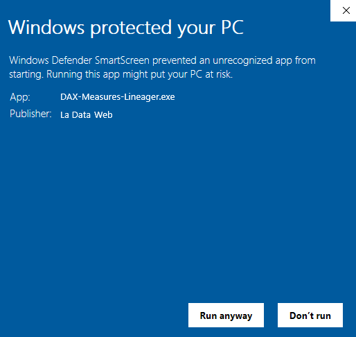

# DAX Measures Lineager - External Tool

DAX Measures Lineager can be installed as a Power Bi External Tool. You can download the exe file from the releases or the manual zip for extracting the files your self.

## Exe Installer

The DAX-Measures-Lineager.exe installer it's just a client that moves the external tool files in specific folders automatically. Windows would probably show the following issue:

That means we don't pay for a software digital signature license for windows to recognize at the installer. This is a community development. You can trust it and click Run anyway. If you don't go ahead with the manual installation you can read next.

## Manual Installation

1. Download and extract the compressed file from releases.
2. Copy the daxmeasureslineager.pbitool.json file to "C:\Program Files (x86)\Common Files\Microsoft Shared\Power BI Desktop\External Tools"
3. Create the following path: "C:\Program Files (x86)\LaDataWeb\DAX Measures Lineager"
4. Copy the SendToWeb.ps1 file to "C:\Program Files (x86)\LaDataWeb\DAX Measures Lineager"

## Use different folders

If you want to copy the SendToWeb.ps1 to a different folder. You can do it. Just make sure you edit daxmeasureslineager.pbitool.json in order to aim to the correct path.