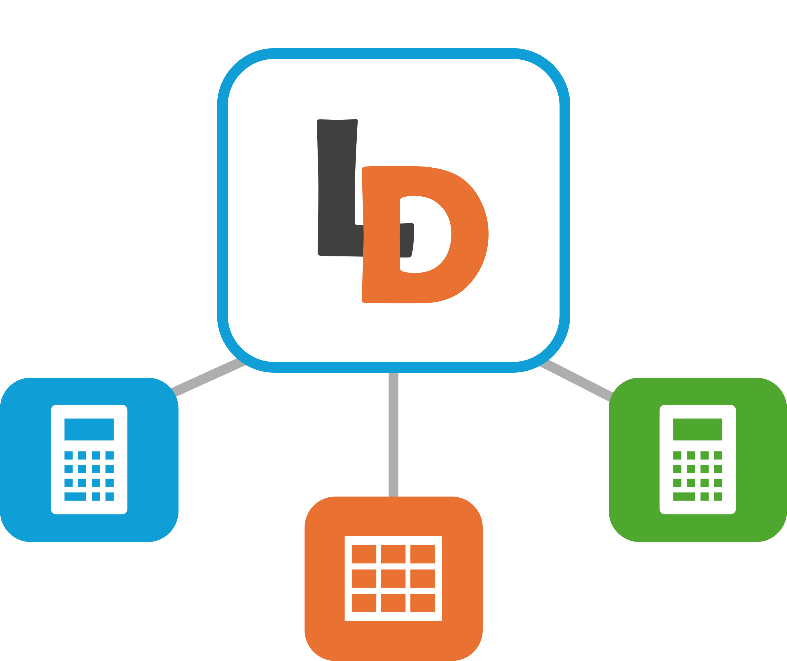

# DAX Measure Lineage Visualizer



## Overview

**DAX Measure Lineage Visualizer** is a web tool for exploring the dependencies and relationships between DAX measures in a Power BI, Tabular, or Analysis Services model. It lets you visually map measures, see how they reference other measures or tables, and quickly navigate complex DAX calculation chains.

This project is a web app that you can run in any browser. This tool can also be added as a Power Bi External tool installed manually or with an exe file.

---

## Features

- **Visualize DAX measure dependencies:** Interactive graph showing measures and tables, with arrows for references.
- **Upload, paste, or auto-load JSON data:** Import your model's measure lineage by uploading a file or pasting JSON.
- **Search and filter:** Quickly find measures and isolate subgraphs for focused analysis.
- **Drag & zoom:** Move nodes, pan, and zoom like Figma or Power BI.
- **Sidebar details:** Click any measure or table for its DAX and references.
- **Export as PNG:** Save the diagram as an image for documentation.
- **Responsive design:** Works on desktop and mobile.

---

## Getting Started

1. **Extract your measure lineage:**
    - Run this DAX query in DAX Studio, Tabular Editor, or Power BI's Query View:

    ```
    EVALUATE 
    { TOJSON(    
        SELECTCOLUMNS(
            FILTER(
                INFO.CALCDEPENDENCY()
                , [OBJECT_TYPE] = "MEASURE" && [REFERENCED_OBJECT_TYPE] <> "COLUMN"            
            )
            ,  "Measure", [OBJECT]
            , "Expression", [EXPRESSION]
            , "Referenced_Object_Type", [REFERENCED_OBJECT_TYPE]
            , "Referenced_Object", [REFERENCED_OBJECT]
        )
    , -1)}
    ```

    - Copy the JSON result.

2. **Open the tool:**
    - [DAX Measures Lineager link](https://ladataweb.github.io/DAX-Measures-Lineage).

3. **Load your data:**
    - Click **Upload JSON** to select your JSON file, or
    - Click **Paste JSON** and paste the copied JSON.

4. **Explore your model:**
    - Pan: Hold middle mouse button and drag.
    - Zoom: Scroll with mouse wheel.
    - Drag nodes: Left-click and drag any box.
    - Click a node: View DAX and references in the sidebar.
    - Search: Type in the search box to highlight or isolate.
    - Export: Click the download icon to save as PNG.

---

## Power Bi External Tool

If you use want to use it as a Power Bi external tool, the click at Power Bi Desktop will open the web at a browser and copy de json to the clipboard to just paste (Ctrl+V) and start using.

---

## Contributing

Pull requests and suggestions are welcome!  
Feel free to open issues for bugs, enhancements, or questions.

---

## License

[MIT](LICENSE)

---

## Contact

Made by [LaDataWeb](https://www.ladataweb.com.ar)  
Questions? Email [ibarrau@ladataweb.com.ar](mailto:ibarrau@ladataweb.com.ar)